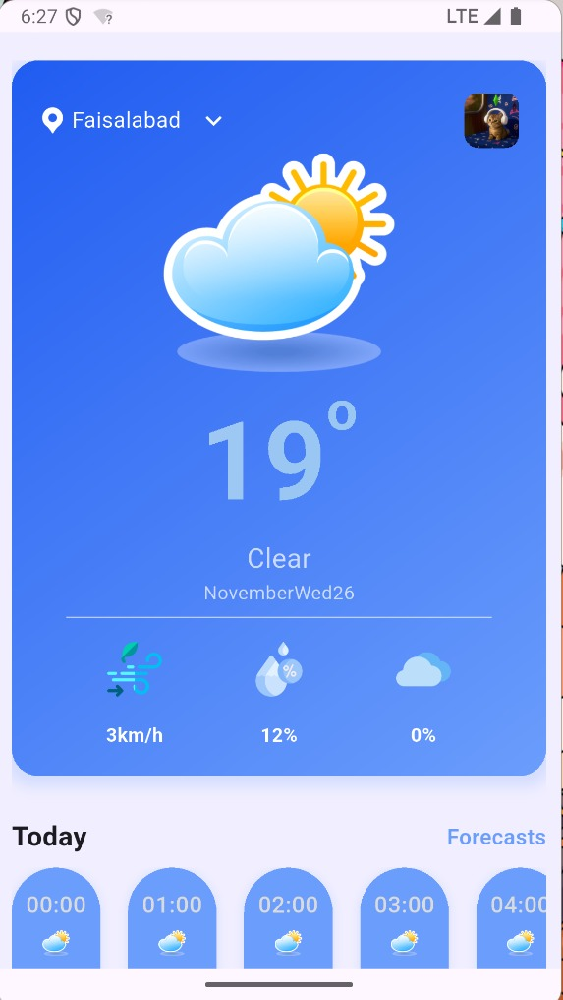
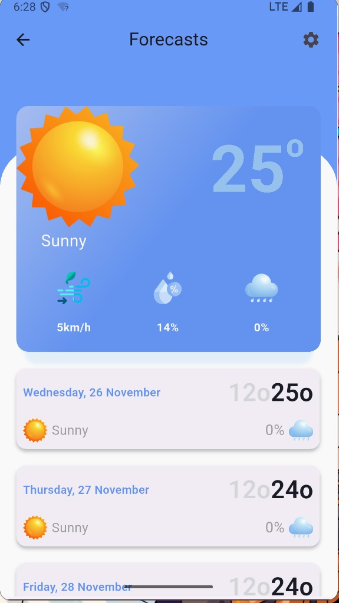

☁️ Flutter Weather App

A modern, responsive weather application built with Flutter and GetX for robust state management. This app fetches real-time weather data and forecasts using a Weather API.

📱 Screenshots

Home Screen

Search City

Details View

Note: Replace the paths above with your actual screenshot paths.

✨ Features

Real-time Weather: Current temperature, humidity, wind speed, and pressure.

Location Based: Automatically detects user location to show local weather (optional).

Search Functionality: Search weather by city name.

State Management: Reactive UI updates using GetX.

Error Handling: Graceful handling of API errors and network issues.

Responsive Design: Optimized for both Android and iOS.

🛠️ Tech Stack

Framework: Flutter

Language: Dart

State Management: GetX

Networking: http (or Dio)

Location: geolocator (if used)

API: OpenWeatherMap (or your specific provider)

🚀 Getting Started

Follow these steps to run the project locally.

Prerequisites

Flutter SDK installed (Installation Guide)

Dart SDK

An IDE (VS Code or Android Studio)

An API Key from your Weather Provider

Installation

Clone the repository:

git clone [https://github.com/your-username/weather-app-getx.git](https://github.com/your-username/weather-app-getx.git)
cd weather-app-getx

Install dependencies:

flutter pub get

Configure API Key:

Check lib/models/constants.dart (or create api_constants.dart if you prefer not to commit keys) to add your API credentials.

Run the app:

flutter run

📂 Project Structure

This project follows a modular structure organized by feature and function.

lib/
├── components/          # Reusable UI widgets
│   └── weather_item.dart
├── controllers/         # GetX Controllers for logic & state
│   └── home_controller.dart
├── models/              # Data models and app constants
│   └── constants.dart
├── ui/                  # Application screens
│   ├── detail_page.dart
│   ├── get_started.dart
│   └── home.dart
└── main.dart            # Application entry point

🤝 Contributing

Contributions are welcome! Please feel free to submit a Pull Request.

Fork the Project

Create your Feature Branch (git checkout -b feature/AmazingFeature)

Commit your Changes (git commit -m 'Add some AmazingFeature')

Push to the Branch (git push origin feature/AmazingFeature)

Open a Pull Request

📄 License

This project is licensed under the MIT License - see the LICENSE file for details.

Made with ❤️ by

$$Your Name$$